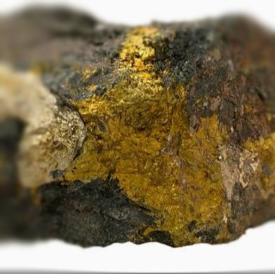

The interaction of Iron (Fe) and sulfur (S) is dynamic. One of the most common Fe-S minerals is pyrite, also know as fool's gold. In wetlands, the formation of pyrite is a process controlled by both oxidation-reduction conditions, available reactive iron (Fe) and free sulfide.

 

 
<bf>

A geologic formation of several minerals. The paler yellow mineral is pyrite (image from [http://www.sandatlas.org/pyrite/](http://www.sandatlas.org/pyrite/)).

 
 

***

### Publications/Presentations:
* Julian, Paul, Alan L. Wright, and Todd Z. Osborne. 2016. Iron and Sulfur Porewater and Surface Water Biogeochemical Interactions in Subtropical Peatlands. Soil Science Society of America Journal 80: 794. ([link](https://dl.sciencesocieties.org/publications/sssaj/abstracts/80/3/794)) (For pdf copy please [contact me](mailto:pjulian@ufl.edu))
 
* Julian, Paul, Randy Chambers, and Timothy Russell. 2017. Iron and Pyritization in Wetland Soils of the Florida Coastal Everglades. Estuaries and Coasts 40: 822–831. ([link](https://link.springer.com/article/10.1007/s12237-016-0180-3)) (For pdf copy please [contact me](mailto:pjulian@ufl.edu))

* Julian, P., R. Chambers, J. Kominoski, and T. Troxler. 2017. Pyrite in the Coastal Everglades, It’s more than Fool’s Gold. Poster presented at the Florida Coastal Everglades Long Term Ecological Research Annual Scientist, Miami, FL.  ([Web Based Version](http://rpubs.com/pjulian/LTER_FeS)) (pdf)

* Julian, P., A.L. Wright, R. Chambers, J. Kominoski, T. Troxler and T.Z. Osborne. 2017. Pyrite Formation in the Coastal Everglades: Can a Fool's Gold Indicate Sea-Level Rise?. ASA/CSSA/SSSA International Annual Conference. Tampa, FL  ([Abstract Link](https://scisoc.confex.com/scisoc/2017am/webprogram/Paper107254.html)) (pdf).

***