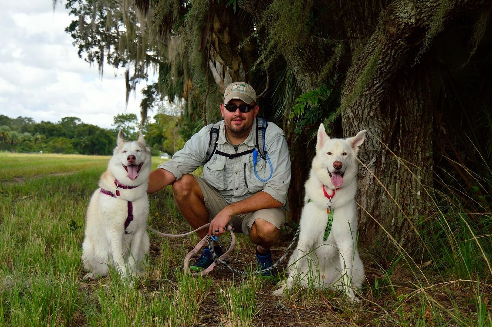
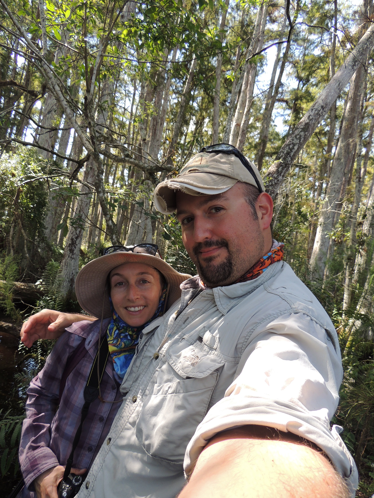

Currently I work for the Sanibel-Captiva Conservation Foundation ([SCCF](http://www.sccf.org/){target="_blank"}) where I provide technical support to the Environmental Policy team to protect and care for Southwest Florida's coastal ecosystems. We work with partners, local stakeholders, State and Federal agencies to advocate for the environment. In addition to my work with SCCF I also am working collaboratively to develop and hone my research and data analysis abilities.

My PhD research focused on understanding biogeochemical processes within the Everglades Stormwater Treatment Areas (wetlands) including nutrient spiraling, nutrient stoichiometry, aquatic productivity and carbon dynamics. I have diverse and varied research interests revolving around aquatic biogeochemistry, ecology and management. My current research interests are split between marine and freshwater wetlands studying the effects of climate change, eutrophication, ecosystem management and restoration on ecosystem function. I like to say that my research spans the aquatic continuum from fresh to marine aquatic ecosystems, and therefore can't isolated me to one system. 

My other academic achievements pre-PhD include obtaining a BSc of biochemistry from Benedictine College (Atchison, Kansas, USA) and MSc of Environmental Science from Florida Gulf Coast University (Fort Myers, Florida, USA). My masters work involved studying Florida Panther (_Puma concolor coryi_) habitat selection and home range dynamics in response to exotic plant removal and management within Big Cypress National Preserve (Florida, USA). Post-bachelor’s degree I immediately entered the work force studying coastal water quality, estuarine dissolved organic matter dynamics and harmful algae blooms in southwest Florida. After several years I decided it was time to purse an advanced degree and took a detour studying something outside of my existing background (wildlife ecology). I was a rather un-traditional student and while working full-time I pursed my master’s degree. After obtaining my master’s degree I moved onto studying seagrass ecology and later to Everglades restoration with a focus on water quality which led me to the wetland biogeochemistry lab at University of Florida where I (un-traditionally) achieved my PhD. 

Outside of work and research I like to get lost in nature by going on long hikes through the bush, document my adventure with photography ([Flickr](https://www.flickr.com/people/swampthingsjourney/){target="_blank"}), snorkel and scuba dive, cook vegan meals, exercise and be overall active. 

