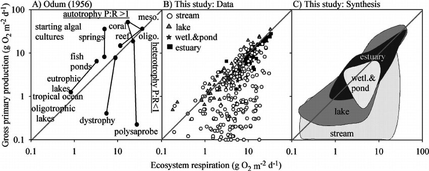

  
  Aquatic productivity or metabolism is a fundamental metric of ecosystem related processes relative to organic matter production and consumption as well as carbon source and sink dynamics. Gross primary productivity is the rate of organic matter production within an ecosystem by photosynthesis, ER is the total consumption of organic matter in an ecosystem via aerobic respiration, and NAP is the balance between GPP and ER. Aquatic metabolism can be driven by several key environmental drivers including water quality (i.e. nutrient concentration) and the quantity, timing and distribution in aquatic ecosystems. 
  
 

 
 

A. Odum’s (1956) synthesis of metabolism measurements across aquatic ecosystems. Points connected by lines were taken within the same site; meso 5 mesosaprobe; oligo 5 oligosaprobe. B. Hoellin et al. (2013) synthesis of data from open-water measurements of metabolism in streams, lakes, wetlands and ponds, and estuaries using identical graphical framework and axes to those in Odum (1956), and C. a plot of the two-dimensional area that encompasses all data points for each of the four ecosystem types. The gray line indicates 1 : 1 value of GPP:ER on each panel (Odum 1956).Figure from [Hoellein et al. (2013) Revisiting Odum (1956): A synthesis of aquatic ecosystem metabolism. Limnology and Oceanography 58:2089–2100](http://onlinelibrary.wiley.com/doi/10.4319/lo.2013.58.6.2089/abstract).

***

### Publications/Presentations:
* Julian P,  et al (2017) Key Factors Controlling Wetland Aquatic Productivity in the Everglades Stormwater Treatment Areas. 2017 Greater Everglades Ecosystem Restoration. Coral Springs, FL. (pdf)

* Julian, P, et al. (2017) Aquatic Productivity in a Subtropical Marsh: Observations from the Everglades Stormwater Treatment Areas. 2017 Society of Wetland Scientist Annual Meeting. Puerto Rico. (pdf)
 
* Julian, P., A.L. Wright, R. Bhomia, T.Z. Osborne and R Villapando. (2017). Aquatic Productivity in a Subtropical Marsh Along a Soil Nutrient Gradient - an Assessment of the Everglades Stormwater Treatment Areas.  ASA/CSSA/SSSA International Annual Conference. Tampa, FL  (Abstract) (pdf).
 
* Julian P, Osborne TZ (2018) From lake to estuary, the tale of two waters: A study of aquatic continuum biogeochemistry. Environment Monitoring and Assessment 190:96 (Journal Link)

***