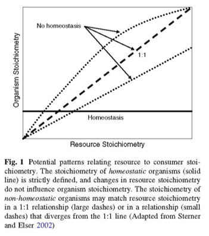

Nutrient stoichiometry is the consequences of mass balance of chemical elements constrained by biology and ecology. The most notable nutrient stoichiometric ratio cited is the “Redfield ratio”. This ratio relates carbon (C), nitrogen (N) and phosphorus (P) between plankton biomass and seawater with a C:N:P ratio of 106:16:1. Several studies have attempted to study “Redfield-like” ratios for terrestrial ecosystems, most focusing on plant biomass nutrients, plant litter, microbes and consumers.

A tenant of ecological stoichiometry is that the abundance of carbon (C), nitrogen (N), phosphorus (P) or other elements is regulated by reciprocal interaction between organisms and their environment. This reciprocation of organism and environmental nutrients is the central theme of stoichiometric homeostasis. Stoichiometric homeostasis was originally developed in the context of ecosystem disturbances and perturbations to assess whether organisms and ecosystems respond to changing conditions and of particular interest with respect to nutrient enrichment processes since nutrient homeostatic regulation has the potential to decouple nutrient transport by selective or variable uptake.

From [Cleveland CC, Liptzin D (2007) C:N:P stoichiometry in soil: is there a “Redfield ratio” for the microbial biomass? Biogeochemistry 85:235–252.](https://link.springer.com/article/10.1007/s10533-007-9132-0)

 
 

***

### Publications/Presentations:
* Julian, P., S. Gerber, R. Bhomia and A.L. Wright (2017) Stoichiometric Relationships Amongst Ecosystem Compartments of a Treatment Wetland. 12th Southeastern Ecology and Evolution Conference. Fort Myers, Florida. 

* Julian, P., et al (2018) One of these things is not like the other. Evaluation of wetland nutrient stoichiometry and homeostasis in a subtropical treatment wetland. 12th International Symposium on Biogeochemistry of Wetlands, Coral Springs, FL. ([Conference Webpage](http://conference.ifas.ufl.edu/biogeo2018/)).

* Julian, P., J.S. Kominoski, E.E. Gaiser and A Wymore. (2018) Is the Everglades Ecosystem a stoichiometric deviant? An investigation of ecological stoichiometry along the aquatic continuum of the Everglades ecosystem. 2018 Florida Coastal Everglades Long Term Ecological Research Annual Scientist Meeting, Miami, FL. 

* Julian, P., et al (2018)  Did you guess which thing was not like the others? Evaluation of wetland nutrient stoichiometry and homeostasis in a subtropical treatment wetland. Society of Wetland Scientists. Denver, Colorado.

* Julian, P., A. Wymore and J.S. Kominoski. (2018) Ecological stoichiometry through the lens of long-term data: Using stoichiometry to understand dynamic ecological systems. Long Term Ecological Research All-Scientist Meeting workshop. Asilomar - Conference Center, Pacific Grove, CA USA. ([workshop repository](https://github.com/SwampThingPaul/LTER_EcoStoich))

***
