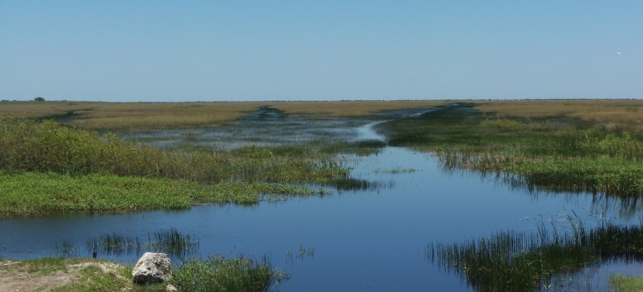

I am an ecologist with a multi-disciplinary background focused on aquatic biogeochemistry and ecology on the landscape scale. Generally, I can be classified as an aquatic biogeochemist studying biogoechemical processes along the freshwater to marine aquatic continuum. I enjoy studying all aquatic ecosystems but wetlands hold a special place in my heart.  

A couple of words/phrases to describe me: Wetland Biogeochemist, Ecologist, Data-scientist, Soil-Scientist, Naturalist, Swamp Walker, Lover of all things R.

This website will host some general information about myself, my research interests and publications.

_#rstats_ _#geospatial_ _#GIS_ _#soil_ _#ecology_ _#climatechange_ _#biogeochemistry_ _#wetland_ _#aquatic_

****

## Social Media

Follow me on twitter for recent development on manuscripts, ongoing studies, colleagues work or opportunities (and some ranting). 

<a class="twitter-timeline" 
href="https://twitter.com/SwampThingPaul?ref_src=twsrc%5Etfw"
data-width="500" 
data-height="300"
data-tweet-limit="2" >
Tweets by SwampThingPaul
</a> 

## Words of inspiration

_“My temple is the swamp …When I would recreate myself, I seek the darkest wood, the thickest and most impenetrable and to the citizen, most dismal, swamp. I enter a swamp as a sacred place, a sanctum sanctorum… I seemed to have reached a new world, so wild a place …far away from human society. What’s the need of visiting far-off mountains and bogs, if a half-hour’s walk will carry me into such wildness and novelty.”_

__Henry David Thoreau__, _Walden and Other Writings_

 
 
_“Whatever you want to do in this world, it is achievable. The most important thing that I’ve found, that perhaps you could use, is be passionate and enthusiastic in the direction that you choose in life, and you’ll be a winner.”_

__Steve Irwin__

 
 

****

 

****

Webpage devloped using [rmarkdown website template](https://github.com/privefl/rmarkdown-website-template) developed by [privefl](https://github.com/privefl)
