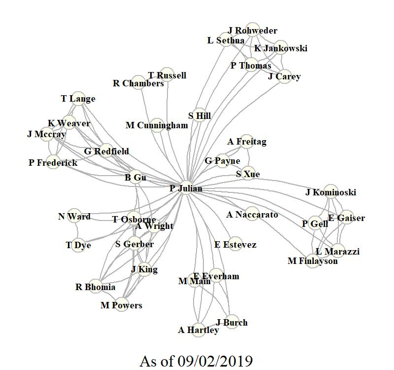

****
<font size=5 color="red">Science is only powerful when shared. </font>
(Unknown)

```{r, out.width="55%",fig.align="center",echo=FALSE}

```

<!----->

<br>
<font size=4><center>Google Scholar Network Analysis using the [scholarnetwork](https://github.com/pablobarbera/scholarnetwork){target="_blank"} r-package.</center></font>


[Google Scholar Profile](https://scholar.google.com/citations?user=lcDejAEAAAAJ&hl=en){target="_blank"}

****

## Peer Reviewed Literature

__2019__

* Julian, P., S. Gerber, R.K. Bhomia, J. King, T.Z. Osborne, A.L. Wright, M. Powers and J. Dombrowski. Evaluation of nutrient stoichiometric relationships among ecosystem compartments of a subtropical treatment wetland. Do we have “Redfield wetlands”? [Ecological Processes. 8:20](https://link.springer.com/article/10.1186/s13717-019-0172-x){target="_blank"}.

__2018__

* Julian, P. and T.Z. Osborne. From lake to estuary, the tale of two waters. A study of aquatic continuum biogeochemistry. [Environmental Monitoring and Assessment. 190:96](https://link.springer.com/article/10.1007%2Fs10661-017-6455-8){target="_blank"}.
* Julian, P. Letter to editor regarding Surratt D, Shindle D, Yongshan W, et al. Letter to the Editor Regarding: Julian P, 2017. Assessment of Upper Taylor Slough water quality and implications for ecosystem management in Everglades National Park. [Wetlands Ecology and Management. 26(3):249-251](https://link.springer.com/article/10.1007/s11273-017-9571-x){target="_blank"}.
* Marazzi, L., C.M. Finlayson, P.A. Gell, __P. Julian__, J.S. Kominoski and E.E. Gaiser. Balancing Wetland Restoration Benefits to People and Nature. [Solutions 9(3)](https://www.thesolutionsjournal.com/article/balancing-wetland-restoration-benefits-people-nature/){target="_blank"}.


__2017__

* Julian, P., S. Gerber, A.L. Wright, B. Gu and T.Z. Osborne. Carbon pool trends and dynamics within a subtropical peatland during long-term restoration. [Ecological Processes. 6:43.](https://ecologicalprocesses.springeropen.com/articles/10.1186/s13717-017-0110-8){target="_blank"}. 
* Julian, P. Assessment of Upper Taylor Slough water quality and implications for ecosystem management in Everglades National Park. [Wetlands Ecology and Management 25(2): 191–209](https://link.springer.com/article/10.1007/s11273-016-9509-8){target="_blank"}.
* Julian, P., R. Chambers, and T. Russell.  Iron and Pyritization in Wetland Soils of the Florida Coastal Everglades. [Estuaries and Coasts 40(3): 822–831](https://link.springer.com/article/10.1007/s12237-016-0180-3){target="_blank"}.

__2016__

* Julian, P.  Commentary on “Mitsch et al., 2015, Protecting the Florida Everglades wetlands with wetlands: Can stormwater phosphorus be reduced to oligotrophic conditions?” Ecological Engineering. 108: 333-337.
* Julian, P., B. Gu, and A.L. Wright.  Mercury Stoichiometric Relationships in a Subtropical Peatland. Water Air Soil Pollut 227(12): 472.
* Julian, P., A.L. Wright, and T.Z. Osborne. Iron and Sulfur Porewater and Surface Water Biogeochemical Interactions in Subtropical Peatlands. Soil Science Society of America Journal 80(3): 794.

__2015__

* Julian, P. South Florida Coastal Sediment Ecological Risk Assessment. Bulletin of environmental contamination and toxicology 95(2): 188–193.
* Julian, P., and B. Gu. Mercury accumulation in largemouth bass (Micropterus salmoides Lacépède) within marsh ecosystems of the Florida Everglades, USA. Ecotoxicology 24(1): 202–214.
* Julian, P., B. Gu, and G. Redfield. Comment on and Reinterpretation of Gabriel et al. (2014) “Fish Mercury and Surface Water Sulfate Relationships in the Everglades Protection Area.” Environmental Management 55(1): 1–5.

__2014__

* Julian, P.  Reply to “Mercury Bioaccumulation and Bioaccumulation Factors for Everglades Mosquitofish as Related to Sulfate: A Re-Analysis of Julian II (2013).” Bulletin of Environmental Contamination and Toxicology 93(5): 517–521.

__2013__

* Julian, P. Mercury Bio-concentration Factor in Mosquito Fish (_Gambusia_ spp.) in the Florida Everglades. Bulletin of Environmental Contamination and Toxicology 90(3): 329–332.
* Julian, P. Comment on “Spatial and temporal phosphorus distribution changes in a large wetland ecosystem” by X. Zapata-Rios et al.: Commentary. Water Resources Research 49(4): 2312–2313.
* Julian, P. Mercury hotspot identification in Water Conservation Area 3, Florida, USA. Annals of GIS 19(2): 79–88.
* Julian, P., and M.W. Cunningham. Total mercury concentration in Florida black bear (_Ursus americanus floridanus_). Florida Scientist 76(1): 1 - 6.

__2012__

* Julian, P., E.M. Everham III, and M.B. Main.  Influence of a Large-scale Removal of an Invasive Plant (_Melaleuca quinquenervia_) on Home-range Size and Habitat Selection by Female Florida Panthers (_Puma concolor coryi_) within Big Cypress National Preserve, Florida. Southeastern Naturalist 11(2): 337–348. 

__2011__

* Julian, P.  Home range dynamics of female Florida panthers in reponse to kitten production. Florida Scientist 74(4).: 215 - 223.

__2010__

* Julian, P. and E.D. Estevez. Historical Bathymetric Analysis of Tampa Bay. Proceeding for Tampa Bay Area Scientific Information Symposium, BASIS 5:20-23 October 2009, St. Petersburg, FL.


****

## Technical Literature

__2018__

* Julian, P., A. Freitag, G.G. Payne, S.K. Xue and K. McClure. Chapter 3A: Water Quality in the Everglades Protection Areas. In 2017 South Florida Environmental Report. South Florida Water Management District, West Palm Beach, FL.
* Julian, P., B. Gu, and K. Weaver (Eds). Chapter 3B: Mercury and Sulfur Environmental Assessment for the Everglades. In 2017 South Florida Environmental Report. South Florida Water Management District, West Palm Beach, FL.

__2017__

* Julian, P., et al. Numeric Interpretation of Narrative Standards for the L-28 Interceptor Canal and Big Cypress National Preserve. Technical Support Document: Western Everglades Planning Project. Florida Department of Environmental Protection, Tallahassee, FL. 
* Julian, P., G.G. Payne, and S.K. Xue. Chapter 3A: Water Quality in the Everglades Protection Areas. In 2017 South Florida Environmental Report. South Florida Water Management District, West Palm Beach, FL.
* Julian, P., B. Gu, and K. Weaver (Eds). Chapter 3B: Mercury and Sulfur Environmental Assessment for the Everglades. In 2017 South Florida Environmental Report. South Florida Water Management District, West Palm Beach, FL.

__2016__

* Julian, P., G.G. Payne, and S.K. Xue. Chapter 3A: Water Quality in the Everglades Protection Areas. In 2016 South Florida Environmental Report. South Florida Water Management District, West Palm Beach, FL.
* Julian, P., B. Gu, G. Redfield, and K. Weaver. Chapter 3B: Mercury and Sulfur Environmental Assessment for the Everglades. In 2016 South Florida Environmental Report. South Florida Water Management District, West Palm Beach, FL.

__2015__

* Julian, P., G.G. Payne, and S.K. Xue. Chapter 3A: Water Quality in the Everglades Protection Areas. In 2015 South Florida Environmental Report. South Florida Water Management District, West Palm Beach, FL.
* Julian, P., B. Gu, G. Redfield, K. Weaver, T. Lange, P. Frederick, J.M. McCray, A.L. Wright, F.E. Dierberg, T.A. DeBusk, M. Jerauld, W.F. DeBusk, H.. Bae, and A. Ogram. Chapter 3B: Mercury and Sulfur Environmental Assessment for the Everglades. In 2015 South Florida Environmental Report. South Florida Water Management District, West Palm Beach, FL.

__2014__

* Julian, P., G.G. Payne, and S.K. Xue. Chapter 3A: Water Quality in the Everglades Protection Areas. In 2014 South Florida Environmental Report. South Florida Water Management District, West Palm Beach, FL.
* Julian, P., B. Gu, R. Frydenborg, T. Lange, A.L. Wright, and J.M. McCray. Chapter 3B: Mercury and Sulfur Environmental Assessment for the Everglades. In 2014 South Florida Environmental Report. South Florida Water Management District, West Palm Beach, FL.

__2013__

* Julian, P., G.G. Payne, and S.K. Xue. Chapter 3A: Water Quality in the Everglades Protection Areas. In 2013 South Florida Environmental Report. South Florida Water Management District, West Palm Beach, FL.

__2012__

* Julian, P., and S. Hill. A.R.M. Loxahatchee National Wildlife Refuge Total Phosphorus Outlier Analysis and Proposed Alternative Screening Criterion: Distribution Independent Outlier Analysis. Everglades Technical Oversight Committee.

__2011__

* Carlson, P., L.A. Yarbro, A. Ritzmann, H. McKnight, A. Viaud, K. Almeida, C. Nosach and P. Julian. Seagrass Recovery in Tampa Bay: Fine-Scale Spatial Analysis to Assess Progress and Refine Restoration Targets. Tampa Bay Estuary Program Report FWC FWRI File Code F2698-F.

__2005__

* Dixon, L.K. and __P. Julian__. Phillippi Creek Optical Brightener Investigation for Sarasota County Water Resources. Mote Marine Lab Technical Report No. 1038.

****

## Thesis/Dissertation

__Dissertation__

* Biogeochemical controls of water column productivity and nutrient cycling in semitropical wetlands – A case study from the Everglades Stormwater Treatment Areas. University of Florida Ph.D. Soil and Water Science (Exit Seminar Presentation [link](https://mediasite.video.ufl.edu/Mediasite/Play/1cec00883964429cb70bb64ee9c75b861d?catalog=231f847b-8d7f-48ef-9156-85798805dbcb){target="_blank"}).

__Thesis__

* Habitat Selection by the Florida Panther in Response to Meleleuca Removal within Big Cypress National Preserve. Florida Gulf Coast Universtiy M.Sc. Environmental Science.