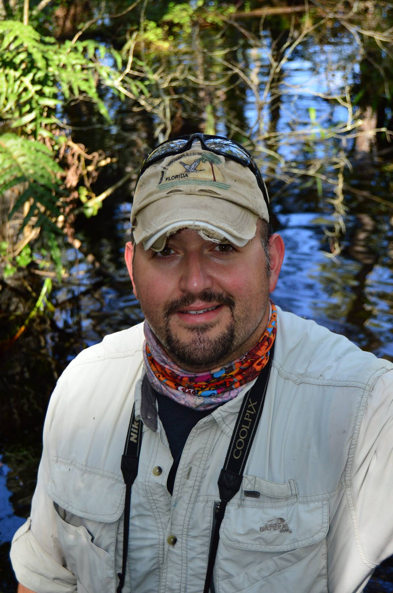

```{css,echo=FALSE}
:root{
  --sidebar-background-color: #f2f2f2;
}

body{
  font-family: "serif",serif;
  
}
a {
  color: #0000EE
}
```

Aside
================================================================================

```{r, out.width="70%",fig.align="center",echo=FALSE}

```

Contact Info {#contact}
--------------------------------------------------------------------------------
- <i class="fa fa-compass"></i> Lehigh Acres, Florida, USA
- <i class="fa fa-envelope"></i> [pjulian@ufl.edu](mailto:pjulian@ufl.edu)
- <i class="fa fa-chrome"></i> [SwampThingPaul.github.io](https://swampthingpaul.github.io/)
- <i class="fa fa-github"></i> [github.com/SwampThingPaul](https://github.com/SwampThingPaul)
- <i class="fa fa-phone"></i> 407-729-8192


Skills {#skills}
--------------------------------------------------------------------------------

- Experienced in statistical analysis of environmental data including chemical, hydrologic and ecologcial data. 


**Computing Skills**

- **Expertise**: ArcGIS, R/RStudio, Markdown, Git/Github, LaTex

- **Familiarity**: QGIS, Python, HTML, Inkscape

Disclaimer {#disclaimer}
--------------------------------------------------------------------------------

Last updated on `r format(Sys.Date(),"%d %B %Y")`.


Main
================================================================================

Paul Julian, PhD {#title}
--------------------------------------------------------------------------------


Education {data-icon=graduation-cap data-concise=true}
--------------------------------------------------------------------------------

### University of Florida

Ph.D. in Soil and Water Science

Gainesville, Florida

2018

**Dissertation:** Biogeochemical controls of water column productivity and nutrient cycling in semitropical wetlands – A case study from the Everglades Stormwater Treatment Areas.

### Florida Gulf Coast University

M.Sc in Environmental Science

Fort Myers, Florida

2010

**Thesis:** Habitat Selection by the Florida Panther in Response to Melaleuca Removal within Big Cypress National Preserve.

### Benedictine College 

B.Sc. in Biochemistry

Atchison, Kansas

2005

**Senior Project:** The Quantitative Study of Mercury in Atchison Area Water Sources.

Professional Experience {data-icon=suitcase}
--------------------------------------------------------------------------------

### Environmental Consultant, Everglades Technical Lead

Florida Department of Environmental Protection

Fort Myers/Tallahassee, Florida

Present - Aug. 2011

::: concise
- Participate in multi-agency regulatory and science review team.
- Perform water quality compliance calculations.
- Conduct data mining and analysis of environmental data.
- Synthesize and author technical reports.
- Technical review of submittals consistent with the Clean Water Act.
- Support federal and state restoration planning efforts.
:::

### Graduate Research Assistant

University of Florida

Gainesville/Fort Pierce, Florida

Aug. 2016 - Aug. 2018

::: concise
- Analysis of water quality and soil nutrient data.
- Aid in writing quarterly and annual reports.
- Participate in project workshops and present project related finds at national and international conferences.
::: 


### Adjunct Faculty

Florida Gulf coast University

Fort Myers, Florida

Jan. 2015 - May 2015

::: concise
- Taught weekly lectures. 
- Graded exams and assignments
:::

- Instructor for ISC 3120: Scientific Process

<br>
<br>

### Biological Scientist III

Florida Fish and Wildlife Reserch Institute

Saint Petersburg, Florida

Jan. 2010 - Aug. 2011

::: concise
- Operation of boats in marine and estuarine environments.
- Collect optical water quality samples and associated data.
- Collect seagrass, macroalge, and sediment for analysis according to US Environmental Protection Agency (USEPA) protocols and/or National Oceanic and Atmospheric Administration (NOAA) Natural Resource Damage Assessment (NRDA) protocols. 
- Geostatistical analysis, photo-interpretation, spatial analysis, and writing reports/summaries
:::

### Lab Manager

University of Florida

Immokalee, Florida

Feb. 2008 - Dec. 2009

::: concise
- Analysis of plant samples for agricultural pathogens including Huanglongbing (HLB; Citrus Greening). 
- Analyses include advanced molecular biological techniques including DNA/RNA isolations, RFPL, PCR, RT-PCR and qPCR.
- Field sampling, data entry and report writing.
- Maintain everyday laboratory operation. 
:::


### Graduate Research Assitant

Florida Gulf Coast University

Fort Myers, Florida

Dec. 2007 - Dec. 2008

- Analysis of existing water quality data to aid in the selection of water quality targets for southwest Florida.


### Technical Director/Chemist

HBEL Inc. (Formerly Harbor Branch Environmental Lab Inc.)

Lehigh Acres/Fort Myers, Florida

Mar. 2007 - Feb. 2008

::: concise
- Analyze drinking water, waste water and environmental samples according approved protocols.
-  Writing technical reports and grants, data entry and field sampling. 
- Maintain everyday laboratory operation. 
- Interact with current and potential clients.
:::

### Staff Chemist II

Mote Marine Labortory

Sarasota, Florida

Dec. 2005 - Mar. 2007

::: concise
- Operation of boats in marine and estuarine environments.
- Collect and analyse sediment and water samples from marine, estuarine and freshwater environments. 
- Maintain a variety of instruments, manage field operations, and data entry.
:::

Licenses & Certifications {data-icon=certificate}
--------------------------------------------------------------------------------

### Professional Wetland Scientist

Society of Wetland Scientists

`N/A`

2018

::: aside
PWS # 2905
:::

### Florida Stormwater Management Inspector

Florida Department of Environmental Protection

`N/A`
  
2013

::: aside
Credential ID 28265
:::

### PADI Open Water Diver

Professional Association of Diving Instructors

`N/A`
  
2009


Honors & Awards {data-icon=trophy}
--------------------------------------------------------------------------------

### Sam Polston Award

University of Florida

`N/A`

2016


### Wetland Biogeochemistry Laboratory Graduate Fellowship 

University of Florida

`N/A`

2015

### Institute of Food and Agricultural Sciences Travel Awards

University of Florida

`N/A`

2015 & 2016

### Chemistry Department Service Award 

Benedictine College

`N/A`

2005

### Discovery Scholar

Benedictine College

`N/A`

2004 & 2005

### Athletic Scholarship

Benedictine College

`N/A`

2001


Synergistic Activities {data-icon=users}
--------------------------------------------------------------------------------

## Extracurricular

###	Florida Coastal Everglades Long Term Ecological Research.

`N/A`

`N/A`

Present - 2018

### Long Term Ecological Research. 

[All Scientist Meeting](https://lternet.edu/lter-scientists-meeting-2018/) Program Committee.

`N/A`

2017- 2018

###	Florida Coastal Everglades Long Term Ecological Research

Student Organization, Off-Campus Representative.

`N/A`

2017 - 2018 

### Greater Everglades Ecosystem Restoration Conference, Mercury and Sulfur Special Session co-organizer

`N/A`

`N/A`

2017 & 2015

## Peer and Technical Reivew

### Peer Review

`N/A`

`N/A`

`N/A`

::: concise
- Wetlands
- Journal of Agriculture
- Ecotoxicology
- Lake and Reservoir Management
- Environmental Management
- Ecological Engineering 
- Science of the Environment
- Ecology and Evolution
- and many more
:::

### Technical Review

`N/A`

`N/A`

`N/A`

::: concise
- South Florida Environmental Report
- Everglades Technical Oversight Committee
- Aquifer Storage and Recover Pilot Project Technical Data Review
:::

## Working Groups and Subteams

### Western Everglades Restoration Planning Project

Water Quality Subteam

`N/A`

`N/A`

### Lake Okeechobee Watershed Restoration Planning Project

`N/A`

`N/A`

`N/A`


### Loxahatchee River Restoration Planning Project

Water Quality Subteam

`N/A`

`N/A`

### Everglades Combined Operation Plan 

Water Quality and Adaptive Management Subteams

`N/A`

`N/A`

### Florida Coastal Everglades Long Term Ecological Research

Biogeochemistry Working Group

`N/A`

`N/A`


## Science Communication

### [Biotweeps](https://biotweep.wordpress.com/) Curator ([Archive](https://twitter.com/search?q=from%3ABiotweeps%20since%3A2018-08-27%20until%3A2018-09-02&src=typd&vertical=default&f=tweets&lang=en))

`N/A`

`N/A`

Aug. 2018

### Content contributor to ["#MacrophyteMonday”](https://twitter.com/search?l=&q=%23MacrophyteMonday%20%20%20from%3Aswampthingpaul&src=typd) and [“#WetlandWednesday”](https://twitter.com/search?q=%23WetlandWednesday%20%20from%3Aswampthingpaul&src=typd).

Twitter

`N/A`

`N/A`

### Blog content (Topics: **ecology, biogeochemistry, statistics, etc.**)

[https://swampthingpaul.github.io/blog/](https://swampthingpaul.github.io/blog/)

`N/A`

`N/A`

<!--http://julienmoeys.info/CV/ --->

Informatics and Programming {data-icon=laptop}
--------------------------------------------------------------------------------

### Creator and maintainer of the R package AnalystHelper

[AnalystHelper](https://github.com/SwampThingPaul/AnalystHelper) (on GitHub)

`N/A`

2019


Publications {data-icon=file-alt}
--------------------------------------------------------------------------------

::: aside
A complete list of publications can be found on my webpage ([link](https://swampthingpaul.github.io/pubs.html)).
:::

## *In Preparation*

### Evaluation of nutrient stoichiometric relationships amongst ecosystem compartments of a subtropical treatment wetland. Do we have "Redfield Wetlands"?

Ecological Processes. *(Submitted)*

`N/A`

`N/A`

**Julian, P.**, et al.  

### A tale of two storms: effects of sea level rise and pre-existing conditions on biogeochemical response to tropical storms.

Frontiers in Marine Science Marine Biogeochemistry. 

`N/A`

`N/A`

**Julian, P.**, et al.  

### Thousand bandages for a thousand cuts. Perspective of water management for the Murray-Darling River.

Environmental Management. 

`N/A`

`N/A`

**Julian, P.**

### Nutrient homeostasis and mechanisms related to nutrient retention by wetland macrophytes in a subtropical wetland.

Aquatic Processes
 
`N/A`

`N/A`

**Julian, P.**, et al.  

<br>
<br>
<br>
<br>

### Translating stream spiraling concepts to wetland nutrient uptake and transport mechanisms in a subtropical treatment wetland.

Environmental Monitoring and Assessment.

`N/A`

`N/A`

**Julian, P.**, S. Gerber and A.J. Reisinger.

### Reduced soil nutrient enrichment and Typha domingensis expansion due to restoration efforts. A temporal analysis of Taylor Slough in Everglades National Park.

Journal of Environmental Management

`N/A`

`N/A`

August, K.A., L.T. Simpson, **P. Julian** and T.Z Osborne.

## Peer-Reviewed (Last Five-Years)

### Balancing Wetland Restoration Benefits to People and Nature.

The Solutions Journal. 9(3) [Link](https://www.thesolutionsjournal.com/article/balancing-wetland-restoration-benefits-people-nature/ )

`N/A`

2018

Marazzi, L., M. Finlayson, P.A. Gell, **P. Julian**, J.S. Kominoski and E.E. Gaiser.

### From lake to estuary, the tale of two waters: a study of aquatic continuum biogeochemistry.

Environmental Monitoring and Assessment. 190:96

`N/A`

`N/A`

**Julian, P** and T.Z. Osborne.

### Letter to editor regarding Surratt D, Shindle D, Yongshan W, et al. Letter to the Editor Regarding: Julian P, 2017. Assessment of Upper Taylor Slough water quality and implications for ecosystem management in Everglades National Park. 

Wetland Ecology and Management. 26(3):249 - 251.

`N/A`

`N/A`

**Julian, P.**

### Carbon pool trends and dynamics within a subtropical peatland during long-term restoration.

Ecological Processes. 6(1):43 – 57

`N/A`

2017

**Julian, P.**, S. Gerber, A.L. Wright, B. Gu and T.Z. Osborne. 

### Assessment of Upper Taylor Slough water quality and implication of ecosystem status in Everglades National Park. 

Wetlands Ecology and Management. 25(2):191-209

`N/A`

`N/A`

**Julian, P.**

### Iron and pyritization in wetland soils of the Florida Coastal Everglades. 

Estuaries and Coasts. 40(3): 191-209

`N/A`

`N/A`

**Julian, P.**, R. Chambers and T. Russell.


### Mercury stoichiometric relationships in a subtropical peatland. 

Water, Air & Soil Pollution. 227(12):472

`N/A`

2016

**Julian, P.**, B. Gu and A. Wright. 

<br>
<br>
<br>
<br>

###  Commentary on “Mitsch et al 2015, Protecting the Florida Everglades wetlands with wetlands: Can stormwater phosphorus be reduced to oligotrophic conditions?” 

Ecological Engineering. 108:333-337

`N/A`

`N/A`

**Julian, P.**


### Iron and Sulfur porewater and surface water biogeochemical interactions in a subtropical peatlands. 

Soil Science Society of America Journal. 80(3):794-802.

`N/A`

`N/A`

**Julian, P.**

### South Florida Coastal Sediment Ecological Risk Assessment. 

Bulletin of Environmental Contamination and Toxicology. 95(2):188-193

`N/A`

2015

**Julian, P.**

### Mercury accumulation in Largemouth Bass (*Micropterus salmoides* Lacépède) within marsh ecosystems of the Florida Everglades, USA. 

Ecotoxicology. 24(1):202-214

`N/A`

`N/A`

**Julian, P.** and B. Gu. 

### Comment on and reinterpretation of Gabriel et al., (2014) ‘Fish mercury and surface water sulfate relationships in the Everglades Protection Area.’ 

Environmental Management. 55(1):1-5

`N/A`

`N/A`

**Julian, P.**, B. Gu and G. Redfield. 

### Reply to “Mercury Bioaccumulation and Bioaccumulation Factors for Everglades Mosquitofish as Related to Sulfate: A Re-Analysis of Julian II (2013).” 

Bulletin of Environmental Contamination and Toxicology. 93(5):517-521

`N/A`

2014

<!--
**Julian, P.**

### Comment on spatial and temporal phosphorous distribution changes in a large wetland ecosystem. 

Water Resources Research. 49(4), 2312-2313.

`N/A`

2013

**Julian, P.**

### Mercury Hotspot Identification in Water Conservation Area 3. 

Annuals of GIS. 19(2):79-88

`N/A`

`N/A`

**Julian, P.**

<br>
<br>
<br>

### Mercury Bioconcentration Factor in Mosquito Fish (*Gambusia* spp.) in the Florida Everglades. 

Bulletin of Environmental Contamination and Toxicology. 90(3):329- 332.

`N/A`

`N/A`

**Julian, P.**

### Total Mercury concentrations in Florida Black Bears (*Ursus americanus floridanius*). 

Florida Scientist. 76(1): 1-6.

`N/A`

`N/A`

**Julian, P.**, and M.W. Cunningham. 

### Influence of large-scale removal of an invasive plant (*Melaleuca quinquenervia* Blake) on home range size and habitat selection by female Florida panthers (*Puma concolor coryi* Bangs) within Big Cypress National Preserve, Florida U.S.A. 

Southeastern Naturalist. 11(2): 337-348.

`N/A`

2012

**Julian, P.**, E.M. Everham, and M.B. Main. 

### Home range dynamics of female Florida panthers in response to kitten production. 

Florida Scientist. 74(4): 215 – 223.

`N/A`

2011

**Julian, P.**

-->

## Technical (Last Five-Years)

### Chapter 3A: Status of water quality in the Everglades Protection Area 

[South Florida Environmental Report](https://www.sfwmd.gov/science-data/scientific-publications-sfer)

`N/A`

2013 - 2019

**Julian, P.**, et al.

### Chapter 3B: Mercury and sulfur environmental assessment for the Everglades.  

[South Florida Environmental Report](https://www.sfwmd.gov/science-data/scientific-publications-sfer)

`N/A`

2014 - 2019

**Julian, P.**, et al.

### Numeric Interpretation of Narrative Standards for the L-28 Interceptor Canal and Big Cypress National Preserve. 

Technical Support Document: Western Everglades Planning Project.

`N/A`

2017

**Julian, P.**, et al.

<!--

### A.R.M. Loxahatchee National Wildlife Refuge Total Phosphorous Outlier Analysis and Proposed Alternative Screening Criterion: Distribution Independent Outlier Analysis.

Everglades Technical Oversight Committee.

`N/A`

2012

**Julian, P.**, E. Marks and S. Hill. 

<br>
<br>
<br>

### Seagrass recovery in Tampa Bay: Fine-scale spatial analyses to assess progress and refine restoration targets. 

Florida Fish and Wildlife Conservation Commission. St Petersburg, FL.

`N/A`

2011

Carlson, P.R., L. Yarbro, A. Ritzmann, H. McKnight, A. Viaud, K. Almeida, C. Nosach and **P. Julian.**

### Philippi creek optical brightener investigation.

Mote Marine Laboratory Technical Report No. 1038. 

`N/A`

2005

Dixon, L.K. and **P. Julian.**

-->

<br>
<br>
<br>
<br>
<br>
<br>
<br>
<br>
<br>

Presentations {data-icon=chalkboard-teacher}
--------------------------------------------------------------------------------

::: aside
Multiple technical presentations not listed here have been presented at meetings including technical, environmental policy, restoration project planning and general public audiences.
:::

## Oral (Last five-years)

### Don't wave the river red gums goodbye. The role of environmental flows in restoring river water quality and riparian zones along the Wimmera River. 

Society of Wetland Scientist Annual Meeting 

Denver, Colorado

2018

**Julian, P.** and G. Fletcher. 

### Let’s take a ride downstream. Translating nutrient spiraling concepts to wetland ecosystems.

Society of Wetland Scientist Annual Meeting 

Denver, Colorado

`N/A`

**Julian, P.**, S. Gerber. A.J. Reisinger, K. Larios. 

### Did you guess which thing was not like the others? Evaluation of wetland nutrient stoichiometry and homeostasis in a subtropical treatment wetland.

Society of Wetland Scientist Annual Meeting 

Denver, Colorado

`N/A`

**Julian, P.**, et al. 

### Translating the effects of sea-level rise in urban systems to the coastal ecosystem interface.  

12<sup>th</sup> International Symposium on Biogeochemistry of Wetlands

Coral Springs, Florida

`N/A`

Osborne, T.Z., M.W. Clark, **P. Julian**, N. Ward, R. Collins, E.J. Philips and P. Fletcher. 

### Biogeochemical response of selected STA flow-ways to different flow scenarios.

12<sup>th</sup> International Symposium on Biogeochemistry of Wetlands

Coral Springs, Florida

`N/A`

Villapando, O., J. King, R.K. Bhomia and **P. Julian**.

### One of these things is not like the other. Evaluation of wetland nutrient stoichiometry and homeostasis in a subtropical treatment wetland.

12<sup>th</sup> International Symposium on Biogeochemistry of Wetlands

Coral Springs, Florida

`N/A`

**Julian, P.**, et al.

### Examining the effects of hurricanes Matthew and Irma on water quality in the inter-coastal waterway, St. Augustine, FL.

American Geophysical Union 

New Orleans, Louisiana
 
2017

Ward, N., T. Dye, **P. Julian** and T.Z. Osborne.

### Stoichiometric relationships amongst ecosystem compartments of a treatment wetland. 
Southeastern Ecology and Evolution Conference

Fort Myers, Florida

`N/A`

**Julian, P.**, R Bhomia, S. Gerber, and A.L. Wright.

<br>

### Pyrite formation in the Coastal Everglades:  Can a fool’s gold indicate sea-level rise?

Society of Soil Scientist of America Annual Meeting

Tampa, Florida

`N/A`

**Julian, P.**, R. Chambers, J. Kominoski, T. Troxler, A. Wright, and T.Z. Osborne. 

### Aquatic Productivity in Subtropical Marsh along a soil nutrient gradient – An assessment of the Everglades Stormwater Treatment Areas.

Society of Soil Scientist of America Annual Meeting

Tampa, Florida

`N/A`

**Julian, P.**, R. Bhomia, A. Wright, and T.Z. Osborne. 

### Spatial Distribution of Soil Biogeochemical Properties in Stormwater Treatment Area 3/4 Cells 3A and 3B.

Society of Soil Scientist of America Annual Meeting

Tampa, Florida

`N/A`

Osborne, T.Z., R. Bhomia, **P. Julian** and K.R. Reddy. 

### Aquatic Productivity in Subtropical Marsh – Observations from the Everglades Stormwater Treatment Areas.

Society of Wetland Scientist Annual Meeting

San Juan, Puerto Rico

`N/A`

**Julian, P.**

### Limiting Factors in Mercury Methylation Hotspot Development: The Tangled Web. 

Greater Everglades Ecosystem Restoration

Coral Spring, Florida

`N/A`

**Julian, P.**, B. Gu and A. Freitag. 

### Data Integration and Synthesis Framework for Understanding the Phosphorus Cycling and Reduction Mechanisms in STA Flow-ways.

Greater Everglades Ecosystem Restoration

Coral Spring, Florida

`N/A`

Gerber, S., K. Larios and **P. Julian**.

### High Biotic Mercury in South Florida Wetlands: Fish Trophic Position and Wading Bird Redistribution.

Greater Everglades Ecosystem Restoration

Coral Spring, Florida

`N/A`

Gu, B and **P. Julian**.

### Water Quality Along inflow to Outflow Gradient of the Everglades Stormwater Treatment Areas.

Greater Everglades Ecosystem Restoration

Coral Spring, Florida

`N/A`

Villapando, O., R. Bhomia, J. King and **P. Julian**.


### Status and Trends of Landscape-Scale Mercury in South Florida and the Everglades.

7<sup>th</sup> SETAC World Congress/SETAC North America 37<sup>th</sup> Annual Meeting

Orlando, Florida

2016

**Julian, P.**, B. Gu, K. Weaver and A. Wright

<br>
<br>

### Alteration of hydrology by mangrove encroachment in saltmarsh ecosystems and potential impacts to ecosystem services.

Ecological Society of America

Fort Lauderdale, Florida

`N/A`

Osborne, T.Z., L.T. Simpson, T.B. Schafer, M. Camacho, **P. Julian II**, N.D. Ward, and L. Laplaca.

### Carbon biogeochemical processes along a Mangrove-Salt Marsh ecotone.

Mangrove & Macrobenthos Meeting 4

Saint Augustine, Florida 

`N/A`

Osborne, T.Z., L.T. Simpson, T.B. Schafer, M. Camacho, **P. Julian II**, N.D. Ward, and L. Laplaca.

### Interpreting effects of water management on soil nutrient cycling in an oligotrophic subtropical wetland. 

Society of Wetland Scientist Annual Meeting

Corpus Christi, Texas

`N/A`

**Julian, P.**, T.Z. Osborne, J. Castro, J. Sadle and L.R. Ellis. 2016.

### Can soil nutrient stoichiometry determine mercury hotspot formation in a subtropical peatland? An Everglades case study.

Society of Wetland Scientist Annual Meeting 

Corpus Christi, Texas

`N/A`

**Julian, P.** and A. Wright.

### Hydrologic restoration of the Taylor Slough Region of Everglades National Park. Changes in water quality and implications for ecosystem management.

5<sup>th</sup> University of Florida Water Institute Symposium 

Gainesville, Florida

`N/A`

**Julian, P.**

###  An Overview of Everglades Mercury Issues: Critical Questions Remain.

Greater Everglades Ecosystem Restoration

Coral Springs, Florida

2015

**Julian, P.**, B. Gu, G. Redfield, and K. Weaver. 

### Spatial and Temporal Variation of Total Mercury in Mosquitofish from Everglades Marshes.

Greater Everglades Ecosystem Restoration

Coral Springs, Florida

`N/A`

Gu, B., **P. Julian** and G. Redfield. 

### 2014. Large-Scale Water Quality Improvement Projects: An Everglades Perspective.

SLER Con

Orlando, Florida

2014

**Julian, P.**

<!--
### Influence of a large-scale removal of an invasive plant (Melaleuca quinquenervia) on home range size and habitat selection by female Florida panthers (*Puma concolor coryi*) within Big Cypress National Preserve. 

75<sup>th</sup> Florida Academy of Science Annual Meeting

Tampa, Florida

2012

**Julian, P.**, E.M. Everham, and M.B. Main.

### Reduction of Home Range Size by the Florida Panther Following Melaleuca Removal in Big Cypress National Preserve.

15<sup>th</sup> Annual Exotic Species Workshop for Southwest Florida. 

Fort Myers, Florida

2010

**Julian, P.** E.M. Everham, A.E. Hartley, M.B. Main and J. Burch. 

### Melaleuca research at Florida Gulf Coast University.

13<sup>th</sup> annual Exotics Species Workshop for Southwest Florida. 

Fort Myers, Florida

2008

**Julian, P.**, et al. 

### The Quantitative Study of Mercury in Atchison Area Water Sources

Benedictine College Discovery Day

Atchison, Kansas

2005

**Julian, P.**, M. Atteberry and P. Steinbach. 
-->

## Poster (Last five-years)

### Is the Everglades Ecosystem a stoichiometric deviant? An investigation of ecological stoichiometry along the aquatic continuum of the Everglades ecosystem.

Florida Coastal Everglades Long Term Ecological Research Annual Scientist Meeting

Miami, Florida

2018

**Julian, P.**, J.S. Kominoski, E.E. Gaiser and A Wymore. 

### Effects of Hurricane Irma on dissolved organic carbon fluxes along a salinity gradient.

12<sup>th</sup> International Symposium on Biogeochemistry of Wetlands

Coral Springs, Florida

`N/A`

Schafer, T.B., N. Ward, **P. Julian**, K.R. Reddy and T.Z. Osborne. 

### Soil nutrient enrichment post hydrologic management: A temporal analysis of Taylor slough.

12<sup>th</sup> International Symposium on Biogeochemistry of Wetlands

Coral Springs, Florida

`N/A`

August, K., **P. Julian** and T.Z. Osborne. 2018. 

### River runs through it. Evaluation of groundwater and surface water connectivity and its implications on riparian biogeochemistry and ecology.

12<sup>th</sup> International Symposium on Biogeochemistry of Wetlands

Coral Springs, Florida

`N/A`

**Julian, P.**, G. Fletcher and A.L. Wright.

### Pyrite in the Coastal Everglades, It’s more than Fool’s Gold.

Florida Coastal Everglades Long Term Ecological Research Annual Scientist Meeting

Miami, Florida

2017

**Julian, P.**, R. Chambers, J. Kominoski and T. Troxler. 

### Key Factors Controlling Wetland Aquatic Productivity in the Everglades Stormwater Treatment Areas.

Greater Everglades Ecosystem Restoration

Coral Spring, Florida

`N/A`

**Julian, P.**, M. Powers, R. Bhomia, A. Wright and J. Dombrowski.

### Spatial Distribution of Soil Biogeochemical Properties in Stormwater Treatment Area 3/4 Cells 3A and 3B.

Greater Everglades Ecosystem Restoration

Coral Spring, Florida

`N/A`

Osborne, T.Z., R. Bhomia, **P. Julian** and K.R. Reddy. 

### Removal of Mercury from Surface Water by Constructed Wetlands in South Florida, USA.

7<sup>th</sup> SETAC World Congress/SETAC North America 37<sup>th</sup> Annual Meeting

Orlando, Florida 

2016

Gu, B., N. Niemeyer and **P. Julian**. 

### Total Phosphorus and Total Nitrogen trends in Upper Taylor Slough, Everglades National Park, Florida.

24<sup>th</sup> Annual Southwest Florida Water Resources Conference

Fort Myers, Florida

2015

**Julian, P.**, G. Redfield and A. Wright.

### Ecosystem Sampling Suitability: Do my monitoring locations represent the water body?

Rookery Bay GIS Symposium

Naples, Florida

2014

**Julian, P.**

<!--
### Panthers in EDEN, Florida panther (Puma concolor coryi) home range responses to hydrologic change.

75<sup>th</sup> Florida Academy of Science Annual Meeting 

Tampa, Florida

2012

**Julian, P.**

### Plant community changes in Big Cypress National Preserve in Response to Melaleuca Removal.

15<sup>th</sup> Annual Exotic Species Workshop for Southwest Florida.

Fort Myers, Florida

2010

**Julian, P.**, E.M. Everham, A.E. Hartley, M.B. Main and J. Burch. 

### Latitudinal Photo Documentation of Mangrove response to a prolonged “freeze” event.

Florida Gulf Coast University Research Day.

Fort Myers, Florida

`N/A`

**Julian, P.** and A. Naccarato 

### Historic Bathymetric Analysis of Tampa Bay.

5<sup>th</sup> Tampa Bay Area Scientific Information Symposium Proceedings. 

Saint Petersburg, Florida

2009

**Julian, P.** and E.D. Estevez. 

### Determination of Metal Concentration in the Missouri River, Atchison, Kansas.

Benedictine College Discovery Day.

Atchison, Kansas

2004

**Julian, P.**, S. Waterman, M. Claus. 

-->

